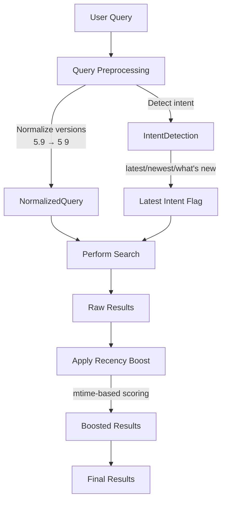

# Docsearch MCP Improvements

## Overview

Improve the docsearch MCP server to better surface recent/latest documentation by adding recency boosting, intent detection, version string normalization, and a `latest` parameter.

## Architecture



## Files to Modify

### 1. Search Parameters and Types

**[src/docsearch/ingest/search.ts](src/docsearch/ingest/search.ts)**

Add new parameters and preprocessing:

```typescript
export interface SearchParams {
  readonly query: string;
  readonly topK?: number;
  readonly source?: SourceType;
  readonly repo?: string;
  readonly pathPrefix?: string;
  readonly mode?: SearchMode;
  readonly includeImages?: boolean;
  readonly imagesOnly?: boolean;
  readonly latest?: boolean;  // NEW: prioritize recent documents
}

// NEW: Normalize version strings (5.9 → 5 9)
function normalizeVersionsInQuery(query: string): string

// NEW: Detect "latest" intent keywords
function detectLatestIntent(query: string): boolean

// NEW: Apply recency boost to results
function applyRecencyBoost(results: SearchResult[], now: number): SearchResult[]
```

Changes:

- Add `normalizeVersionsInQuery()` to convert "5.9" to "5 9" for FTS5 compatibility
- Add `detectLatestIntent()` to detect keywords like "latest", "newest", "what's new", "recent"
- Add `applyRecencyBoost()` to boost scores based on document mtime
- Increase default topK from 8 to 15
- When `latest` is true or detected, filter to recent 60 days and boost heavily

### 2. Search Result Type

**[src/docsearch/ingest/adapters/types.ts](src/docsearch/ingest/adapters/types.ts)**

Add mtime to SearchResult:

```typescript
export interface SearchResult {
  // ... existing fields ...
  readonly mtime: number | null;  // NEW: document modification time
}
```

### 3. SQLite Adapter

**[src/docsearch/ingest/adapters/sqlite.ts](src/docsearch/ingest/adapters/sqlite.ts)**

Update search queries to return mtime:

- Modify `keywordSearch()` SQL to include `d.mtime`
- Modify `vectorSearch()` SQL to include `d.mtime`

### 4. MCP Server Tool

**[src/docsearch/server/mcp.ts](src/docsearch/server/mcp.ts)**

Add `latest` parameter to doc-search tool:

```typescript
server.registerTool(
  'doc-search',
  {
    inputSchema: {
      // ... existing ...
      latest: z.boolean().optional(),  // NEW
    },
  },
  // ...
);
```

Update tool description to mention the new parameter.

### 5. Rule File

**[.roo/rules/mcp-servers.md](.roo/rules/mcp-servers.md)**

Add comprehensive query tips:

```markdown
### Query Tips for Better Results

- For latest/newest content: use `latest: true` parameter or include "latest" in query
- Version numbers: use spaces not dots ("TypeScript 5 9" not "5.9")
- Broad topics: increase `topK` to 10-15
- Exact matches: use `mode: "keyword"`
- Multi-query strategy: start specific, broaden if needed
```

## Implementation Details

### Recency Boost Formula

```typescript
const RECENCY_BOOST_DAYS = 60;  // Documents newer than this get boosted
const MAX_BOOST = 0.3;          // Maximum 30% score boost

function applyRecencyBoost(results: SearchResult[], now: number): SearchResult[] {
  return results.map(r => {
    if (!r.mtime) return r;
    const ageMs = now - r.mtime;
    const ageDays = ageMs / (24 * 60 * 60 * 1000);
    if (ageDays > RECENCY_BOOST_DAYS) return r;
    
    // Linear boost: newer = higher boost
    const boost = MAX_BOOST * (1 - ageDays / RECENCY_BOOST_DAYS);
    return { ...r, score: r.score * (1 + boost) };
  }).sort((a, b) => b.score - a.score);
}
```

### Latest Intent Detection

```typescript
const LATEST_KEYWORDS = [
  'latest', 'newest', 'recent', 'new', "what's new",
  'current', 'updated', 'last version'
];

function detectLatestIntent(query: string): boolean {
  const lower = query.toLowerCase();
  return LATEST_KEYWORDS.some(kw => lower.includes(kw));
}
```

### Version Normalization

```typescript
function normalizeVersionsInQuery(query: string): string {
  // Convert "5.9" to "5 9", "v5.9" to "v5 9"
  return query.replace(/(\d+)\.(\d+)/g, '$1 $2');
}
```

## Testing

After implementation:

1. Restart docsearch MCP server
2. Test query: `doc-search { query: "TypeScript 5.9 features" }` - should find 5.9 with normalized query
3. Test query: `doc-search { query: "what's new TypeScript", latest: true }` - should prioritize recent docs
4. Test query: `doc-search { query: "TypeScript release notes" }` - should show 5.9 near top due to recency