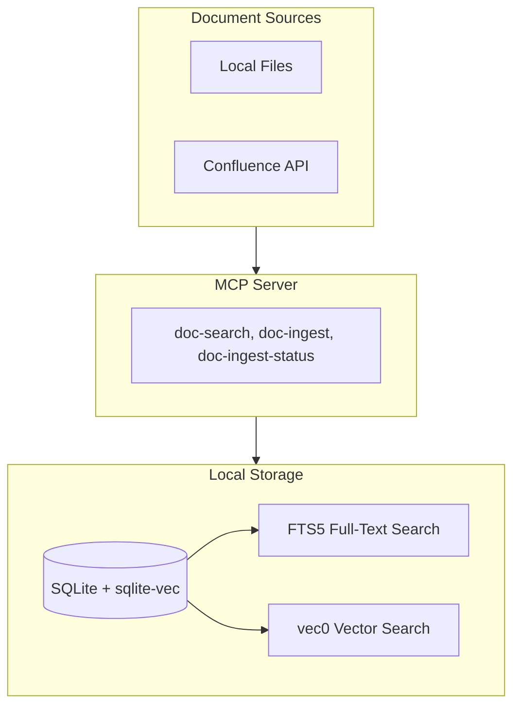

# Make docsearch a 100% Local SQLite-vec Fork

## Overview

Remove all PostgreSQL support from docsearch to create a simplified, fully local solution that uses SQLite with sqlite-vec for both storage and vector search. No external database services required.

## Architecture (After Changes)



## Files to Delete

- [src/docsearch/ingest/adapters/postgresql.ts](src/docsearch/ingest/adapters/postgresql.ts) - PostgreSQL adapter
- [src/docsearch/__tests__/integrations/postgresql.test.ts](src/docsearch/__tests__/integrations/postgresql.test.ts) - PostgreSQL tests
- [src/docsearch/__tests__/integrations/simple-postgres.test.ts](src/docsearch/__tests__/integrations/simple-postgres.test.ts) - PostgreSQL simple tests
- [src/docsearch/__tests__/integrations/adapter-comparison.test.ts](src/docsearch/__tests__/integrations/adapter-comparison.test.ts) - Cross-adapter comparison tests

## Files to Modify

### 1. Package Dependencies - [src/docsearch/package.json](src/docsearch/package.json)

Remove PostgreSQL dependencies:

- `pg`
- `pgvector`
- `@types/pg`

Remove dev dependency (uses Docker which is not available):

- `@testcontainers/postgresql`

### 2. Adapter Factory - [src/docsearch/ingest/adapters/factory.ts](src/docsearch/ingest/adapters/factory.ts)

Simplify to only create SQLite adapters:

```typescript
import { SqliteAdapter, type SqliteConfig } from './sqlite.js';
import { CONFIG } from '../../shared/config.js';
import type { DatabaseAdapter } from './types.js';

export function createDatabaseAdapter(config?: Partial<SqliteConfig>): DatabaseAdapter {
  const sqliteConfig: SqliteConfig = {
    path: config?.path ?? CONFIG.DB_PATH,
    embeddingDim: config?.embeddingDim ?? CONFIG.OPENAI_EMBED_DIM,
  };
  return new SqliteAdapter(sqliteConfig);
}
```

### 3. Adapter Index - [src/docsearch/ingest/adapters/index.ts](src/docsearch/ingest/adapters/index.ts)

Remove postgresql export:

```typescript
export * from './types.js';
export * from './sqlite.js';
export * from './factory.js';
```

### 4. Config - [src/docsearch/shared/config.ts](src/docsearch/shared/config.ts)

Remove:

- `DatabaseType` type (keep only sqlite)
- `DB_TYPE` config property
- `POSTGRES_CONNECTION_STRING` config property
- `validateDatabaseType` function

### 5. CLI Main - [src/docsearch/cli/main.ts](src/docsearch/cli/main.ts)

Remove CLI options:

- `--db-type`
- `--postgres-connection-string`

### 6. CLI Ports - [src/docsearch/cli/domain/ports.ts](src/docsearch/cli/domain/ports.ts)

Simplify database config type to only sqlite.

### 7. CLI Config Provider - [src/docsearch/cli/adapters/config/env-config-provider.ts](src/docsearch/cli/adapters/config/env-config-provider.ts)

Remove:

- `postgresConnectionString` from overrides
- `validateDatabaseType` function
- PostgreSQL config handling

### 8. MCP Server - [src/docsearch/server/mcp.ts](src/docsearch/server/mcp.ts)

Remove `CONFIG.DB_TYPE` reference from the config object (line 169).

### 9. README - [src/docsearch/README.md](src/docsearch/README.md)

Complete rewrite focusing on:

- 100% local, no external services required
- SQLite + sqlite-vec for storage and vector search
- Simple setup (just set OPENAI_API_KEY and FILE_ROOTS)
- Remove all Docker references (not available in your environment)
- Remove all PostgreSQL documentation
- Emphasize compatibility with restricted environments

## New README Structure

```
# docsearch-mcp (Local Fork)

100% local document search MCP server using SQLite + sqlite-vec.
No Docker, no external databases, no cloud services required.

## Features
- Hybrid semantic + keyword search
- Local file indexing (code, docs, PDFs)
- Confluence integration (optional)
- SQLite storage with FTS5 and vector search

## Quick Start
1. Set OPENAI_API_KEY
2. Set FILE_ROOTS to directories to index
3. Run mcp-server-docsearch

## Configuration
(simplified environment variables)

## MCP Tools
- doc-search
- doc-ingest  
- doc-ingest-status
```

## Summary of Removals

| Component | Removed Items |

|-----------|--------------|

| Dependencies | pg, pgvector, @types/pg, @testcontainers/postgresql |

| Files | postgresql.ts, 3 test files |

| Config | DB_TYPE, POSTGRES_CONNECTION_STRING |

| CLI Options | --db-type, --postgres-connection-string |

| Docs | All PostgreSQL and Docker references |