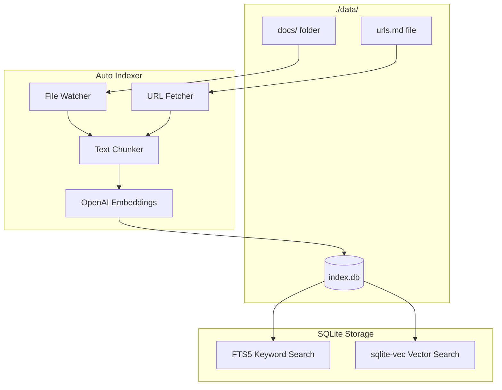

# Docsearch Simplified Local Fork

## Overview

Transform docsearch into a simplified, 100% local MCP server with:

- Fixed folder structure (`./data/docs/` for files, `./data/urls.md` for web pages)
- SQLite + sqlite-vec only (remove PostgreSQL)
- Automatic indexing on startup and file changes
- No complex configuration needed

## New Architecture



## Folder Structure

```
./data/
  ├── docs/           # Drop files here to index
  │   ├── readme.md
  │   ├── api-docs.pdf
  │   └── code/
  │       └── example.ts
  ├── urls.md         # List URLs to fetch (one per line)
  └── index.db        # SQLite database (auto-created)
```

## urls.md Format

Simple text file with one URL per line:

```markdown
# Documentation URLs (lines starting with # are ignored)
https://docs.example.com/api
https://github.com/user/repo/blob/main/README.md

# Blog posts
https://blog.example.com/article
```

---

## Part 1: Remove PostgreSQL (from previous plan)

### Files to Delete

- `src/docsearch/ingest/adapters/postgresql.ts`
- `src/docsearch/__tests__/integrations/postgresql.test.ts`
- `src/docsearch/__tests__/integrations/simple-postgres.test.ts`
- `src/docsearch/__tests__/integrations/adapter-comparison.test.ts`

### Files to Simplify

- `src/docsearch/package.json` - Remove pg, pgvector, @types/pg, @testcontainers/postgresql
- `src/docsearch/ingest/adapters/factory.ts` - SQLite only
- `src/docsearch/ingest/adapters/index.ts` - Remove postgresql export
- `src/docsearch/shared/config.ts` - Remove DB_TYPE, POSTGRES_CONNECTION_STRING
- `src/docsearch/cli/main.ts` - Remove --db-type, --postgres-connection-string
- `src/docsearch/cli/domain/ports.ts` - Simplify database type
- `src/docsearch/cli/adapters/config/env-config-provider.ts` - Remove postgres config
- `src/docsearch/server/mcp.ts` - Remove CONFIG.DB_TYPE reference

---

## Part 2: Simplified Folder Structure

### Update Config - [src/docsearch/shared/config.ts](src/docsearch/shared/config.ts)

Replace configurable paths with fixed structure:

```typescript
// Fixed paths relative to process.cwd() or configurable base
const DATA_DIR = process.env.DOCSEARCH_DATA_DIR || './data';

interface AppConfig {
  readonly DATA_DIR: string;          // Base data directory
  readonly DOCS_DIR: string;          // DATA_DIR/docs
  readonly URLS_FILE: string;         // DATA_DIR/urls.md  
  readonly DB_PATH: string;           // DATA_DIR/index.db
  // ... embeddings config remains
}
```

### Update File Source - [src/docsearch/ingest/sources/files.ts](src/docsearch/ingest/sources/files.ts)

Change to use fixed `DOCS_DIR` instead of `FILE_ROOTS`:

```typescript
export async function ingestFiles(adapter: DatabaseAdapter): Promise<void> {
  const docsDir = CONFIG.DOCS_DIR;
  
  // Ensure docs directory exists
  await fs.mkdir(docsDir, { recursive: true });
  
  // Index all files in docs directory
  const files = await fg(['**/*'], {
    cwd: docsDir,
    ignore: ['**/node_modules/**', '**/.git/**'],
    absolute: true,
  });
  // ... rest of indexing logic
}
```

---

## Part 3: New URL Source

### Create New File - `src/docsearch/ingest/sources/urls.ts`

New source that reads URLs from `urls.md` and fetches web pages:

```typescript
import { readFile } from 'node:fs/promises';
import { CONFIG } from '../../shared/config.js';
import { sha256 } from '../hash.js';
import { chunkDoc } from '../chunker.js';
import type { DatabaseAdapter } from '../adapters/index.js';

// Parse urls.md - one URL per line, skip empty and comments
function parseUrlsFile(content: string): string[] {
  return content
    .split('\n')
    .map(line => line.trim())
    .filter(line => line && !line.startsWith('#') && line.startsWith('http'));
}

// Fetch and extract text from HTML page
async function fetchPageText(url: string): Promise<string> {
  const response = await fetch(url);
  const html = await response.text();
  // Use turndown to convert HTML to markdown (already a dependency)
  // Or simple regex to extract text content
  return extractTextFromHtml(html);
}

export async function ingestUrls(adapter: DatabaseAdapter): Promise<void> {
  const urlsFile = CONFIG.URLS_FILE;
  
  // Check if urls.md exists
  try {
    const content = await readFile(urlsFile, 'utf-8');
    const urls = parseUrlsFile(content);
    
    for (const url of urls) {
      const text = await fetchPageText(url);
      const hash = sha256(text);
      
      // Check if already indexed with same hash
      const existing = await adapter.getDocument(url);
      if (existing?.hash === hash) continue;
      
      // Index the page
      const docId = await adapter.upsertDocument({
        source: 'url',
        uri: url,
        title: extractTitle(url),
        hash,
        // ...
      });
      
      const chunks = chunkDoc(text);
      await adapter.insertChunks(docId, chunks);
    }
  } catch (error) {
    // urls.md doesn't exist, skip
  }
}
```

### Update Types - [src/docsearch/shared/types.ts](src/docsearch/shared/types.ts)

Add 'url' to SourceType:

```typescript
export type SourceType = 'file' | 'confluence' | 'url';
```

---

## Part 4: Auto-Indexing on Startup

### Update MCP Server - [src/docsearch/server/mcp.ts](src/docsearch/server/mcp.ts)

Add automatic indexing when server starts:

```typescript
export async function startServer() {
  // Ensure data directories exist
  await ensureDataDirectories();
  
  // Run initial indexing
  await runIndexing();
  
  // Start file watcher for auto re-indexing
  startFileWatcher();
  
  // Connect MCP transport
  const transport = new StdioServerTransport();
  await server.connect(transport);
}

async function ensureDataDirectories() {
  await fs.mkdir(CONFIG.DOCS_DIR, { recursive: true });
  // Create empty urls.md if it doesn't exist
  if (!existsSync(CONFIG.URLS_FILE)) {
    await fs.writeFile(CONFIG.URLS_FILE, '# Add URLs to index (one per line)\n');
  }
}
```

---

## Part 5: Update README

Complete rewrite for simplified UX:

````markdown
# docsearch-mcp (Local Fork)

100% local document search for MCP. Drop files in a folder, list URLs in a file, search with AI.

## Quick Start

1. Set your OpenAI API key:
   ```
   OPENAI_API_KEY=sk-...
   ```

2. Add documents:
   - Drop files in `./data/docs/`
   - Add URLs to `./data/urls.md`

3. Run the server - it auto-indexes everything

## Folder Structure

./data/
  ├── docs/       # Your documents (md, pdf, code, etc.)
  ├── urls.md     # URLs to fetch and index
  └── index.db    # Search database (auto-created)

## Environment Variables

| Variable | Required | Description |
|----------|----------|-------------|
| OPENAI_API_KEY | Yes | For embeddings |
| DOCSEARCH_DATA_DIR | No | Data folder (default: ./data) |

## MCP Tools

- `doc-search` - Search your documents
- `doc-ingest` - Manually trigger re-indexing
- `doc-ingest-status` - Check indexing status
````

---

## Summary of Changes

| Area | Changes |

|------|---------|

| Storage | SQLite only, remove PostgreSQL |

| Config | Fixed paths: ./data/docs/, ./data/urls.md, ./data/index.db |

| Sources | Files from docs/, URLs from urls.md |

| New Feature | URL fetching and indexing |

| Startup | Auto-create directories, auto-index |

| UX | Zero config needed (just OPENAI_API_KEY) |